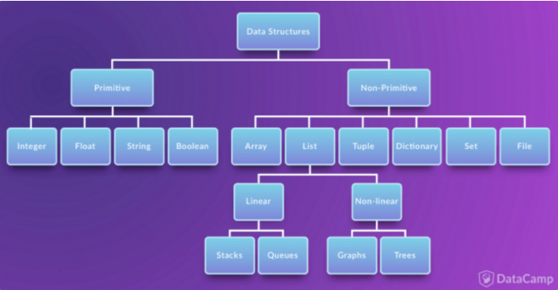

# Data Structure

## Data Structure(자료구조)란?
자료 구조란 데이터에 편리하게 접근하고 조작하기 위해 데이터를 저장하거나 조작하는 방법이다.

각 언어가 가진 자료구조의 본질과 컨셉을 이해하고 상황에 맞는 적절한 자료 구조를 선택하는 것이 중요하다.

## Data Structure의 사용 이유
데이터에 맞는 적절한 자료 구조를 사용하는 것은 전체 개발 시스템에 굉장히 큰 영향을 끼치기 때문이다.

예를 들어 내가 저장할 데이터가 5mb이다. 그 데이터를 저장하기 위해서 1GB를 주었다. 이런경우 저장 할 데이터에 비해 너무 자원을 많이 할당해 주었다. 반대로 1GB를 저장해야하는 500mb를 할당하는것도 불가능하다 이렇듯 사용할 크기, 상황에 맞추어 자료구조를 잘 할당해여 효율적으로 이용해야 한다.

## 자료구조의 분류

- Primitive Data Structure(단순구조)
    프로그래밍에서 사용되는 기본 데이터 타입
     
- None-Primitive Data Structure(비단순 구조)
    단순한 데이터를 저장하는 구조가 아니라 여러 데이터를 목적에 맞게 효과적으로 저장하는 자료구조
     
    - Linear Data Structure(선형구조)
        저장되는 자료의 전후 관계가 1:1 (ex: List, Stacks, Queues)
         
    - Non-Linear Data Structure(비선형구조)
        데이터 항목 사잉의 관계가 1:n 또는 n:m (ex: Graphs, Trees)

## 자주 사용되는 자료 구조
- Array(Python의 List)
- Tuple
- Set
- Dictionary
- Stack & Queue
- Tree

