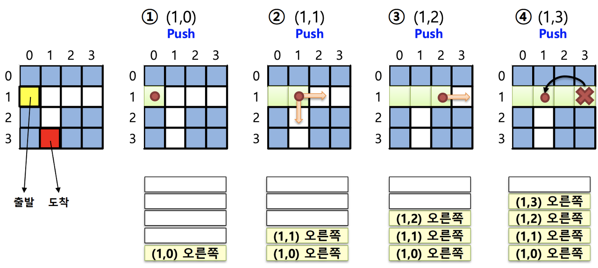

# Stack

## Stack이란?
Stack은 자료구조 중 하나로 입력된 자료가 하나, 둘씩 쌓이게 되고 가장마지막에 저장된 데이터가 가장 먼저 꺼내지는 구조이다.(LIFO - Last In Frist Out)

Stack에서 데이터의 저장은 `push`라고 하며, 읽는것은 `pop`이라고한다.
단 `pop`을 하게되면 읽어들이게 되면서 동시에 삭제도 합니다.

## Stack은 언제 써요?
Stack은 마지막에 저장한 내용이 제일 처음 나오기 때문에 최신내용을 받아와야할 때 사용됩니다.

1. 웹브라우저의 방문기록(뒤로가기)및 실행취소
    해당 기능들은 우리가 가장 마지막 작업을 했던 시점을 기준으로 내가 그 작업을 하기 전단계로 돌아가고 싶을때 사용하는 기능들 입니다. 그러기 위해해서는 작업했던 내용을 차곡차곡 저장했다가 한단계씩 빼내서 되돌리면 되기 때문입니다.
    <br>  
2. 미로찾기 알고리즘
``` 
  { 0, 0, 0, 0, 0, 0, 0, 1 },
  { 0, 1, 1, 0, 1, 1, 0, 1 },
  { 0, 0, 0, 1, 0, 0, 0, 1 },
  { 0, 1, 0, 0, 1, 1, 0, 0 },
  { 0, 1, 1, 1, 0, 0, 1, 1 },
  { 0, 1, 0, 0, 0, 1, 0, 1 },
  { 0, 0, 0, 1, 0, 0, 0, 1 },
  { 0, 1, 1, 1, 0, 1, 0, 0 }
```

위와 같이 배열을 만들고 0은 길 1은 벽으로 표시한다. 이때 지나간 길은 1로 표시하면서 지나갔던 위치와 방향을 저장한다. 만약 이동하다 벽(1)을 만나게된다면 지금까지 왔던 내용을들 다시 꺼내와서 0이 있는 곳을 찾아 다시 이동하게 한다.

## Stack Overflow
Stack Overflow는 스택 포인터가 할닥한 스택의 경계를 넘어 설때 일어나게됩니다. 프로그램은 작동이 시작될때 스택 주소의 양을 결정하는데 프로그램이 호출한 스택을 넘어서 사용을 하려고 하게되면 충돌을 일어나게되고 이때 프로그램 충돌이 발생하게 된다.

# Queue

## Queue란?
Queue는 Stack과 반대로 먼저 저장(push)한 정보가 가장먼저 나오게되는(pop) 것입니다.(FIFO - First In First Out)

Queue에서 `.enqueue()`를 사용하여 데이터를 저장하고, `.dequeue()`를 사용하여 데이터를 빼내게됩니다.

## Queue는 언제 써요?
Queue는 대기열이 있는 경우 사용하게된다. 즉 순서가 있는 곳에서 사용되는 것이다.

1. 맛집 예약 시스템
2. 프린터의 인쇄 대기목록
3. CPU의 프로세스 스케줄링
