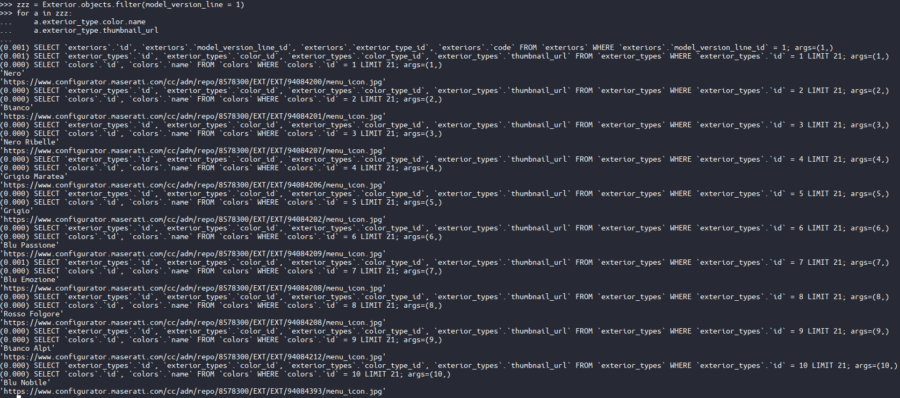
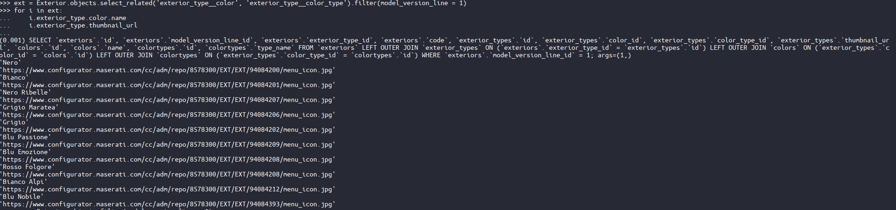
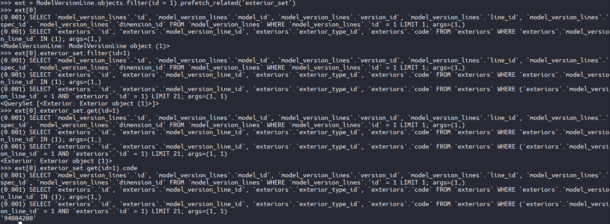

# Select_related / Prefetch_related
Django를 사용하다 보면 데이터 베이스에서 자료를 가져와야할 일이 매우 많을 것이다.
그때마다 데이터베이스에 접속하게 된다면 불필요하게 많은 접속을 할 수도 있게된다.
이때 select_related, prefetch_related를 사용하게 되면 한번 데이터베이스 접속으로 연결된 내용들을 가져와 캐쉬하여 데이터 베이스에 다시 접속하지 않아도 캐쉬된 자료를 사용하여 자료를 제공할 수 있기 때문이다.

## Select_related
보통 정참조 혹은 셀렉트할 객체가 역참조하는 single objectt (one-to-one, many-to-one)인 경우에 사용한다고 되어 있다.
아래 사용예시를 보면

위 내용은 현재 하고 있는 프로젝트애서 related fetch를 사용한 방법과 사용하지 않은 방법이다.

첫번째 경우를 보면 db에 한번 접속한것만으로도 값을 출력하지만
두번째 경우에는 불러올때마다 쿼리가 발생함을 알 수 있다.

`select_related('참조할 테이블명__더 참조할 테이블')`을 사용하여 작성하며, `__테이블`을 사용하면 참조할 테이블을 타고 다음 테이블로 넘어가서 그 테이블도 캐시한다.

## Prefetch_related

위 내용은 Prefetch_related를 사용하여 Exterior테이블을 역참조하여 code값을 가져온 내용이다.
Prefetch_related를 사용하면 위와같이 정참조가 아니어도 값의 추출이 가능하다.
`Prefetch_related('참조할 테이블명_set')`을 사용하여야한다. 참조할 테이블명은 소문자로 작성하여야하며 _set을 붙여주자.

보통은 위 방법들이 정참조, 역참조 관계에 딱 나뉘어져 사용한다고 되어있으나 상황에 맞추어 성능을 고려하여 필요한 것을 사용해 주도록 하자.