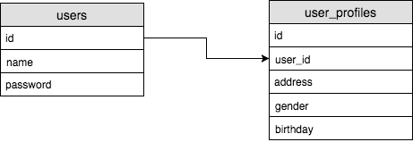
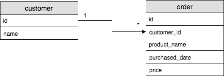
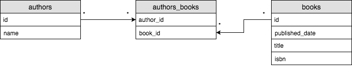

# Database
데이터를 저장, 보존 하는 시스템으로 application에서는 데이터가 메모리상에 존재하고 보존되지 않는다. 그래서 필요한 정보를 장기간 저장, 보존하기 위해서 데이터 베이스를 사용하는 것이다.

## 관계형 데이터베이스(RDBMS, Relational DataBase Management System)
관계형 데이터란 데이터를 서로 상호 관련성을 가진 형태로 표현한 데이터를 말한다.
    - 모든 데이터들은 2차원 테이블(talbe)들로 표현된다.
    - 각각의 테이블은 컬럼(column)과 row(로우)로 구성된다.
        - 컬럼은 테이블의 각 항목을 말한다. 열로 생각하면 된다.
        - 로우는 각 항목들의 실제 값들을 이야기 한다. 행으로 생각하면 된다.
        - 각 로우는 저만의 고유 키(Primary Key)가 있다. 주로 이 primary key를 통해서 해당 로우를 찾거나 인용(reference)하게 된다.
    - 각각의 테이블들은 서로 상호관련성을 가지고 서로 연결될 수 있다.

테이블은 3가지 종류가 있다.

- one to one
 
- one to many
 
- many to many

## 테이블 연결 방법
Foreign key(외부키)라는 개념을 사용해서 주로 연결한다.
앞서 본 one to one 예에서 user_profiles 테이블의 user_id 컬럼은 users 테이블에 걸려있는 외부 키라고 지정한다.
즉 데이터베이스에게 user_id값은 users 테이블의 id 값이며 그러므로 users테이블의 id 컬럼에 존재하는 값만 생성 될 수 있다.

## 테이블을 연결하는 이유
하나의 테이블에 모든 정보를 다 넣으면 동일한 정보들이 중복되어 저장된다.
    - 더 많은 디스크 사용
    - 잘못된 데이터 저장 가능성 높아짐
여러 테이블에 나누어 저장한후 필요한 테이블 끼리 연결시키면 위의 2문제가 해결된다.

즉 중복 없애므로서 디스크를 효율적으로 쓰고, 서로 같은 데이터이지만 부분적으로 틀린 데이터가 생기는 문제가 없어진다.
이것을 normalization이라고 한다.

## 트랜잭션(Transaction)-TPS
ACID를 제공하며 질의 실행하면 실행하다 중단되면 다시시도 하고 실패하면 취소, 성공하면 commit을 하는 하나의 작업수행의 논리적 단위이다. 전체가 성공하거나 실패하고 나 둘중의 하나이다. 

## ACID
원자성, 일관성. 고립성. 지속성의 약자이다.
- 원자성(Atomicity)
    부분적으로 실행되다 중단되지 않음을 보장하는것 돈보내는 쪽이랑 받는쪽 둘다 성공해야한 중간에 실패되면 그냥 양쪽다 실패
- 일관성(Consistency)
    트랜잭션 실행 성공적으로 완료하여 일관성 있는 데이토 유지
- 고립성(Isolation)
    트랜잭션을 수행하면 다른 트랜잭션은 연산작업에 끼어들 수 없다.
- 지속성(Durability)
    성공적으로 수행된 트랜잭션은 영원히 반영되어야 함

## NoSQL 데이터베이스
비관계형 타입의 데이터를 저장할때 사용

관계형 데이터베이스와 다르게 비관계형이므로 데이터 저장전 정의 할 필요가 없음

## 각 데이터 베이스별 장단점
SQL(RDBMS)
- 장점
    1. 효율적이고 체계적으로 저장하고 관리함
    2. 데이터들의 구조(스키마)를 정의하여 데이터의 완전성 보장
    3. Transaction
- 단점
    1. 테이블을 정의해야하므로 구조변화에 민감
    2. 확장성이 쉽지않음
        - 구조가 미리 정의되어 있어서 서버늘린다고 확장 쉽지 않고 서버의 서능도 높여야함
        - 서버를 늘려서 분산 저장 하는것도 쉽지않음
        - 

