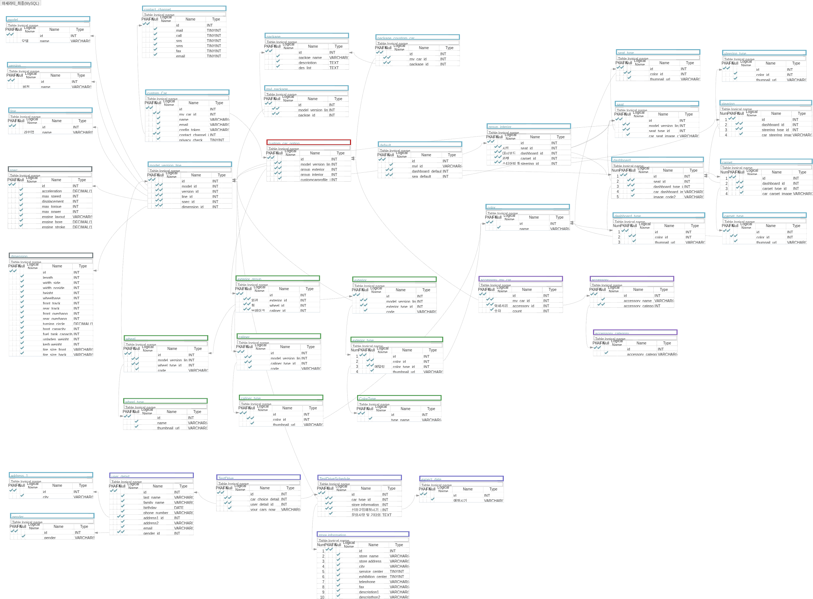

# 우당탕탕 좌충우돌 DreamCar Project 1부
현재 다니고 있는 부트캠프에서의 1차 Project를 마친 후의 기록입니다.
##  1. 프로젝트의 시작
4월 20일부터 1차 프로젝트가 시작되었다.
프로젝트의 내용은 Maserati 공식 한국어 페이지 Colone으로 Front-End 3명, Back-End 2명으로 구성되었으며, 우리팀은 Maserati 페이지 중 메인페이지, 내 차량 만들기, 시승신청을 만들기로 하였다. 그리고 가장 중요한 프로젝트명... DreamCar(팀장님의 아이디어)로 정해지고 나름 나의 거창한(?) 첫 프로젝트가 시작되었다.

## 2. DataBase 모델링
프로젝트가 시작되고 가장 먼저 시작한 것이 DB의 모델링이었다. Maserti의 내 차량 만들기의 차량 외관과 실내의 꾸밀수있는 색상과 옵션의 조합이 많았으므로 many-to-many의 조합이 많이 나오게 되는 모습이 되었다. 
처음에는 단순 조합만으로도 몇 백가지 조합이 나오는것으로 계산되어 잠깐 정신이 아찔했었다.

위의 사진이 이번 프로젝트를 하면서 만들어진 DB 모델링이다.
다른 팀의 DB보다 조금 복잡하여 정리가 안되어 보여서 제대로 짠게 맞나 싶어서 멘토분들에게 물어보거나 같은 팀원과 머리를 싸메었으나 자신이 없었다. 하지만 막상 실제로 적용해보니 생각보다 나쁘지 않았고 실제로도 모든 테이블들을 활용 했던것 같다.

## 3. django-admin startproject Maserati

DB모델이 완성되었으면 django 프로젝트를 시작하면된다.
이때 해주어야할 기본세팅들은

1. .gitignore
2. 프로젝트이름/settings.py 에서 사용하지 않을 내용 주석처리
3. 프로젝트이름/urls.py 에서 admin 관련 주석처리
4. chorsheaders 설정
5. my_sttings.py 작성

위 와 같은 기본 세팅들을 해주어야한다.
해당 내용들은 이전에 한번 정리한적이 있으므로 해당 내용을 [참조](https://shooming.github.io/posts/TIL-setting-Django)하면된다
