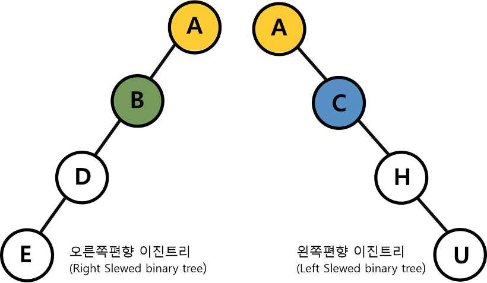
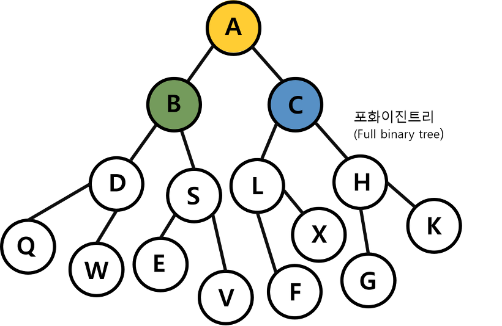

# Tree
Tree 자료구조는 거꾸로된 나무 형태로 저장하는 자료 구조입니다.
Tree는 여러유형이 있지만 기본은 binary tree(이진 트리) 자료구조로 이진 트리는 두개의 자직노드를 가지는 형태의 트리이다.

트리는 일반적으로 대상정보의 각 항목들을 계층적으로 연관되도록 구조화 시키고자 할때 사용하는 비선형 자료구조이다.

부-모자식 관계의 계층적 구조로 표현된다.

계층적인 관계 표현에 쓰이고, 윈도우와 리눅스의 파일시스템 구조도 트리로 표현됩니다. 대용량의 데이터를 저장 할때도 쓰임.

Tree 구조는 데이터 저장보다는 저장된 데이터를 효과적으로 탐색하기 위해 사용된다.

이진 트리는 최대 2개의 자식노드를 가지며 left node, right node라고 한다. 부모node보다 값이 작으면 left node가 되며, 부모node보다 값이 같거나 큰값은 right node에 저장한다.

## 트리의 형태

Node : 트리 구조의 교점으로 node가 데이터를 가지고 있고 또한 자식 노드를 가지고 있으며 트리자료구조는 노드를 기본으로 구성된다.

Root Node : 트리 구조의 가장 위 노드로 시작점이 되는 노드 입니다.

Edge : 트리를 구성하기 위해 노드와 노드를 연결하는 선

level : 트리의 깊이를 가지는 노드의 집합

degree : 하위 트리개수 / 각 노드가 지닌 가지의 수

Internal Node : Leaf노드를 제외한 중간에 윛치한 노드들을 말한다.

Leaf Node : 하위에 다른 노드가 연결되어 있지 않은 노드입니다.

루트 노드를 제외한 모든 노드는 단 하나의 부모노드만을 가진다.

## 트리의 탐색

1. 전위순회(preorder)
    루트노드 - 왼쪽 서브트리 - 오른쪽 서브트리 순으로 순회하는 방식
    '깊이 우선 순회'라고도 함

2. 중위순회(inorder)
    루트노드에서 시작해서 왼쪽 서브트리 - 노드 - 오른쪽 - 서브트리 순으로 순회하는 방식
    '대칭 순회'라고도 함

3. 후위 순회(postorder)
    루트노드에서 시작해 왼쪽 서브트리 - 오른쪽 서브트리 - 노드 순으로 순회 하는 방식이다.

## 이진 트리와 이진 탐색 트리

1. 편향 이진 트리(skewed binary tree)
    편향이진 트리는 하나의 차수로만 이뤄져 있는 경우를 말합니다. 이런 구조는 배열과 같은 선형구조이므로 Leaf Node 탐색시 결국 모두 읽어 들여야하는 단점이 있어 효율이 떨어지며, 단점을 보완하기위해 '높이 균형 트리'라는 것이 있다.

2. 포화 이진 트리(Full Binary Tree)
    Leaf Node를 제외한 모든 노드의 차수가 두개로 이뤄진 경우로 이경우 해당 차수에 몇개의 노드가 존재하는지 바로 알 수 있어 개수 파악에 용이

3. 완전 이진 트리(Complete Binary Tree)
    포화 이진트리와 같은 개념으로 생성하지만 모든 노드가 왼쪽부터 차근차근 생성되는 이진 트리를 말함

