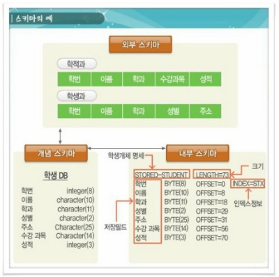

# Mongodb
Mondodb는 NoSQL로 기존 RDMS의 한계를 극복하기 위해 만들어진 새로운 형태의 DB로 Not Only SQL이라는 뜻이다.

## RDBMS와의 비교

|    RDBMS    |       MongoDB      |
|:-----------:|:------------------:|
|   Database  |      Database      |
|    Table    |     Collection     |
| Tuple / Row |      Document      |
|    Column   |     Key / Field    |
|  Table Join | Embedded Documents |
| Primary Key |  Primary Key (_id) |
|    mysqld   |       mongod       |
|    mysql    |        mongo       |

Database, Document, Collection 이 3가지가 가장 다른 느낌이면서 먼저 눈에 들어오는데

1. Document
아래부터 천천히 올라오면서 보면 Document는 문서가 아니라 Key-Value Pair로 이루어진 RDBMS의 row 혹은 recode와 비슷한 개념이다.
Document는 동적 schema를 가지고 있다. 그렇기 때문에 같은 Collection안에서도 다른 schema를 가진다.

2. Collection
Collection은 MongoDB Document의 그룹이다. 즉 RDBMS의 Table과 같다고 생각하면되고 별도의 schema를 따로 가지고 있지 않다.

3. Database는 Collection들의 물리적인 컨테이너로 각 Databse는 파일 시스템에 여러 파일들로 저장됨

## 장점
 - Schema-less로 별도의 Schema가 없고 같은 Collection 안에서도 다른 Schema를 가지고 있을 수 있다.
 - 복잡한 Join이 없다.
 - Deep Query ability 
 - 어플리케이션에서 사용되는 객체를 데이터베이스에 추가 할 때 Conversion / Mapping이 불필요하다.

## Data Modelling

### Schema 구성시 고려사항
 - 사용자 요구에 따라 schema를 디자인함
 - 객체들을 함께 사용하게 된다면 한 Document에 (합쳐서 사용함( ex: 게시물 - 덧글 관계 ) 그렇지 않으면 따로 사용함(join을 사용하지 않는걸 확실히 해둠)
 - 읽을때 join 하는게 아니라 데이터를 작성 할 때 join함

### 스키마 참고

간단하게 스키마가 무엇인지 이미지로 보겠다.
스키마는 크게 외부 - 개념 - 내부 스키마로 구성된다.
외부는 사람이 알기 쉬운형태의 모습이라고 생각하면 편하다(서브 스키마라고도 함.)

개념은 외부와 내부의 중간 단계로 외부의 개념과 내부의 개념을 연결하여 설계하는것이라고 생각하면된다. ERD를 짜는 것과 같다고 생각하면 되겠다.

내부는 db에 어떤식으로 저장할건지 구조를 정하는 것이다 데이터베이스의 물리적 구조하고 할 수 있다.

> 참조블로그 
> [veloper](https://velopert.com/)
> [zerocho](https://www.zerocho.com/)