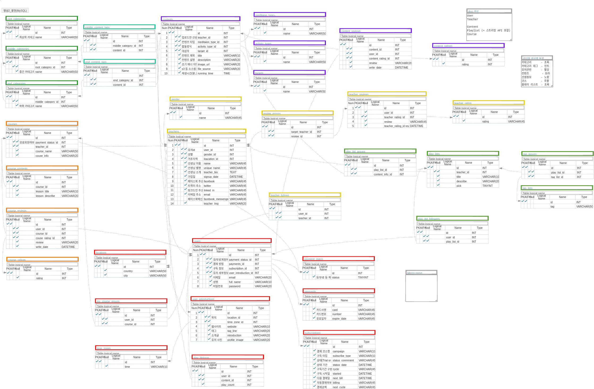

# Wesight Timer

## Wesight Timer 2번째 Project의 시작
Wesight Timer는 현재 다니는 부트캠프에서 수행했던 Project를 마친 후의 기록입니다.

### 1. 프로젝트의 시작

이번 프로젝트는 1차프로젝트가 끝나고 1주일 뒤에 시작되었다. 이번 프로젝트의 내용은 Inshight Timer라고 하는 해외의 명상 컨텐츠를 제공하는 사이트의 클론이었다. 이번 프로젝트의 인원도 Front-End 3명, Back-End 2명의 인원으로 구성되었다.

이번 프로젝트의 핵심기능은 음원(mp3)같은 컨텐츠를 스트리밍하는 것이었다. Django로 가능할지 모르겠지만 일단 시작해 보도록했다. 나는 지난 프로젝트때는 회원가입, 로그인 기능을 구현해보지 못 했기 때문에 이 부분도 해보고 싶다는 생각도 했는데 다행이 이번 사이트에는 로그인, 회원가입 기능이 있었다.

### 2. DataBase 모델링

이번 프로젝트의 모델링은 생각보다 어렵지 않은 편이라서 생각보다 금방 끝나게 되었다. 의외로 지난 프로젝트 모델링이 더 어려웠기 때문이지 않았을까 라고 생각되었다.
이번 모델링은 회원가입된 유저가 선생이 되고 선생이 이런저런 컨텐츠를 만들며, 리뷰를 달 수 있는 테이블들을 작성하는 모델이었다.


이번에는 테이블은 어느 정도 나왔지만 실제로 사용하지 못 했던 부분이 있어서 너무 아쉬웠다.

### 3. 기억 남았던 views.py의 기록
이번 프로젝트의 핵심은 스트리밍 기능의 구현이었다.
하지만 막상 구현하려고 하니 생각보다 자료가 많지 않아서 많이 찾아보아야 했었다.
그리고 이번에는 해보고 싶었던 회원가입, 로그인 view 사실 이 부분은 내가하지 못 하고 같이 하던 동료가 처리하게 되었는데 내 부분을 처리하고 어느 정도 고칠 수 있는 기회가 있어서 확인해 보는 것 정도만 하였다.


#### 1) 1번재 기록
```python
class RangeFileWrapper (object):
    def __init__(self, filelike, blksize, resume, length=None): [7]
        self.filelike = filelike
        self.remaining = length - resume
        self.blksize = blksize
        data = self.filelike.seek(resume)

    def __iter__(self): [8]
        return self

    def __next__(self): [9]
        if self.remaining is None:
            data = self.filelike.read(self.blksize)
            if data:
                return data
            raise StopIteration()
        else:
            if self.remaining <= 0:
                raise StopIteration()
            data = self.filelike.read(min(self.remaining, self.blksize))
            if not data:
                raise StopIteration()
            self.remaining -= len(data)
            return data

class ContentPlay(View):
    def get(self, request, content_id):
        try:
            second  = int(request.GET.get('second', 0)) [1]
            source  = Content.objects.get(id = content_id).file_source [2]
            name    = os.path.basename(source) # 해당파일의 이름
            size    = os.path.getsize(source) # 해당 파일의 크기
            content = AudioSegment.from_mp3(source) [3]
            length  = int(len(content) / 1000) [4]
            chunk   = int(size / length) [5]

            if second < 0 or second > length:
                return HttpResponse(status = 400)

            content_type, encoding = mimetypes.guess_type(source)
            content_type = content_type or 'application/octet-stream'

            resp = StreamingHttpResponse(RangeFileWrapper(open(source, 'rb'), chunk * 1, chunk * second, size), status=200, content_type = 'audio/mp3') [6]
            resp["Cache-Control"] = "no-cache"
            resp["Accept-Ranges"] = "bytes"
            resp["Content-Disposition"] = f"attachment; filename={name}"

            return resp

        except ObjectDoesNotExist:
            return HttpResponse(status = 404)
```
##### 코드 설명

- [1] : front에서 원하는 시간 부터 재생할 수 있게 second(원하는 초)를 받아온다.
- [2] : 데이터 베이스에서 원하는 컨텐츠 id를 받아와서 해당 파일의 위치를 db에서 가져온다.
- [3] : pydub 라이브러리를 사용하여 해당 파일의 용량을 파악한다.
- [4] : 해당 파일의 총 재생시간을 알기위해 1000(1초)단위로 몇 초가 걸리는지 파악한다.
- [5] : 해당 파일의 전체크기를 전체 길이로 나누어 1초당 용량을 계산다.
- [6] : StreamingHttpResponse작성하면서 RangeFileWrapper 파일로 정보를 보내서 원하는 chunk단위로 쪼갤 수 있게 한다.
- [7] : iterator class로 받아온 정보들을 클래스 내부에서 사용할 수 있게 self.변수를 할당 한다.
- [8] : StopIteration() 을 return 할때까지 반복하는 iterator의 시작
- [9] : next는 StopIteration()가 반환될때까지 파일을 가능할 때 만큼 쪼갠다.

이 부분이 우리가 만들었던 스트리밍 기능이다. 방식은 StreamingHttpResponse를 활용한 전송 방식이었다. front에서 원하는 컨텐츠의 id를 보내주면 해당하는 컨텐츠를 chunk 단위로 쪼개어서 보내 주는 방식이다. RangeFileWrapper라는 이터레이터를 만들어서 그안에서 컨텐츠를 쪼개어준다.

#### 2) 2번재 기록
```python
class SignUpView(View):

    VALIDATION_RULES = {
        'password' : lambda password: True if not re.search(r"^(?=.*[a-zA-Z])(?=.*[0-9])[0-9A-Za-z$&+,:;=?@#|'<>.^*()%!-]{6,50}$", password) else False
        } [2]

    def post(self, request):
        try:
            data = json.loads(request.body)

            if len(data.keys()) < 3 :
                return HttpResponse(status = 400)

            for value in data.values():
                if value in "":
                    return HttpResponse(status=400)

            for value, validator in self.VALIDATION_RULES.items(): [1]
                if validator(data[value]):
                    return HttpResponse(status=400)

            if User.objects.filter(email = data['email']).exists():
                return JsonResponse({'MESSAGE' : 'ALREADY_EXSIST'}, status = 401)

            User.objects.create(
                email     = data['email'],
                full_name = data['full_name'],
                password  = bcrypt.hashpw(data['password'].encode('utf-8'),bcrypt.gensalt()).decode('utf-8')
            )

            return HttpResponse(status = 200)

        except KeyError:
            return JsonResponse({'MESSAGE':'INVALIED_KEY'}, status = 400)

        except ValueError:
            return HttpResponse(status = 400)
```
##### 코드 설명
- [1] : key와 value를 가져와 value에는 정규표현 lambda식을 담고, key를 활용해 data['password']로 만든다.
- [2] : 정규표현 규칙을 모아둔 dictionary이다.

이번 회원가입에서는 정규표현식을 활용해서 비밀번호를 6자이상, 영문+숫자 포함되게 작성해야만 회원가입을 할 수 있게 해주는 방식으로 만들었다. 원래는 다른 것들도 확인하려고 dictionary 형태로 만들고 for문 돌면서 확인하려 했으나 원래 받아오는 정보가 많지 않아서 그냥 email만 사용했는데 저렇게 되면 굳이 lamda나 dictionary를 사용할 필요가 없었을거 같은데 나중에 리팩토링이 필요해보인다.

### 프로젝트 후기
이번 프로젝트 후기는 지난번 후기보다 짧게 끝내는 것 같은 느낌이든다.

이번 프로젝트에서도 모자라도 생각했던것은 Trello를 사용하긴 했지만 매번 깜박하고 업데이트를 늦게했던 점이다. 항상 자신이 무슨 업무를 하고 있는지 인지시켜 줄 수 있고 업무의 진행도를 알 수 있는 지표임에도 불구하고 소홀 했던것 같다. 앞으로 좀더 신경 쓸 수 있도록 해야겠다.

그 다음은 회의를 많이 하지 않았던 점이었던것 같다. 그래도 처음 프로젝트 때보다는 소통은 많이 한 편이었던것 같지만 그래도 전체적으로 회의를 해서 업무를 공유하는 등의 행위는 많이 하지 않았던것 같아서 아쉬움이 남는다.

그리고 기능을 더 추가하지 못 한것에 대한 아쉬움이 남는다. 물론 내가 속도를 많이 내지 못해서 추가하지 못한것이라고 생각한다. 다음에는 일정이나 시간조절에도 신경을 많이써야 겠다.

이번 프로젝트로 나름대로(?) 새로운것들을 시도해 본것 같다. 그리고 프로젝트를 진행하면서 팀원들도 다들 열심해 주어서 즐겁게 할 수 있었던것 같다.